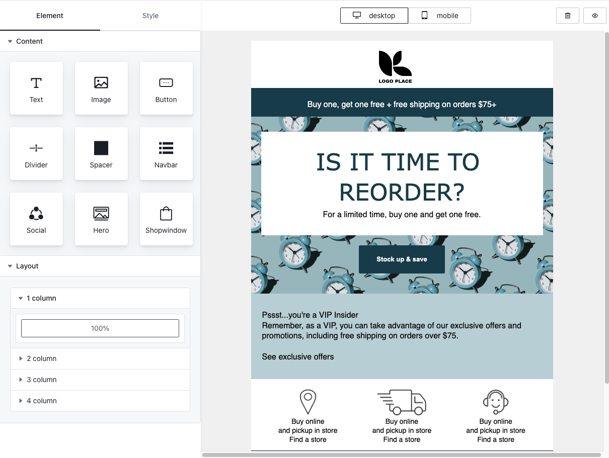

## Getting Started

Easy-email-pro simplifies the creation of responsive email templates by combining the editing capabilities of SlateJS with the compatibility of MJML. With drag-and-drop functionality, inline editing, and keyboard shortcuts, users can easily design visually appealing and feature-rich email templates.

Build marketing campaigns, newsletters, or transactional emails effortlessly with Easy-email-pro. Create professional-grade responsive email templates efficiently.

## Live Demo

Check out the live demo here https://demo.easyemail.pro/full

<div style="font-size:0">
  
  
</div>
<br/>
<div>
  
</div>

### Update client id

Modify the following in vite.config.ts", free user use client id
"FREE"

```bash

"process.env.CLIENT_ID": JSON.stringify('your client id'),

```

```bash

pnpm install

pnpm dev

```

### Open http://localhost:3000/simple

## Pure JavaScript Integration

If you want to integrate Easy-email-pro using pure JavaScript without any framework, follow these steps:

1. First, build the standalone version:

```bash
npm run build:iife
```

This will generate two files in the `build` directory:

- `easy-email-pro.js`
- `style.css`

2. Copy these files to your project's assets directory.

3. Include the files in your HTML:

```html
<link rel="stylesheet" href="./build/style.css" />
<script src="./build/easy-email-pro.js"></script>
```

4. Initialize the editor:

```html
<div id="editor"></div>
<script>
  const editor = EasyEmailPro.initEditor("editor", {
    clientId: "your-client-id",
    height: "calc(100vh - 50px)",
    initialValues: yourTemplate,
    onUpload: (file) => {
      // Implement your file upload logic here
      return Promise.resolve(uploadedFileUrl);
    },
  });
</script>
```

For a complete example, check out our [pure HTML implementation](./pure.html).

We also have examples of Vue, nextjs and iframe integration, which you can find here
(All examples)[https://github.com/orgs/Easy-Email-Pro/repositories]
